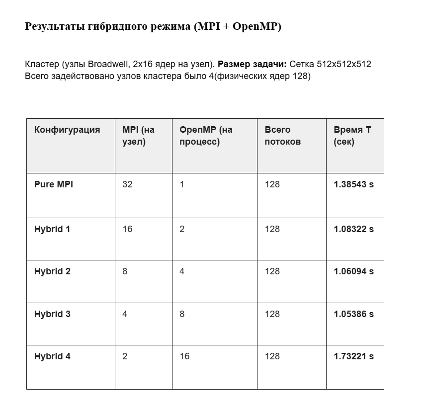

# Решение дифференциального уравнения в частных производных (уравнения Пуассона) в трехмерной области с использованием гибридной модели распараллеливания (MPI + OpenMP).

**Описание алгоритма и метода распараллеливания**

Для численного решения используется итерационный метод Якоби на равномерной трехмерной сетке 

**Применена одномерная декомпозиция (1D Decomposition)**.

Трехмерная область ("куб") разрезается на слои вдоль одной из осей 
Каждый MPI-процесс хранит свой слой данных плюс два "теневых" слоя (граничные плоскости соседних процессов) для обмена данными.

**Гибридная схема (MPI + OpenMP)**:
Для эффективного использования кластера применена двухуровневая модель:
Между узлами (MPI): Процессы обмениваются границами своих областей (halo exchange) с помощью неблокирующих функций MPI_Isend / MPI_Irecv.
Внутри узла (OpenMP): Вычисление значений во внутренних точках слоя распараллеливается между потоками с помощью #pragma omp parallel for.

Асинхронные вычисления (сокрытие коммуникаций):
Реализована схема перекрытия вычислений и обменов:
Процесс инициирует отправку границ соседям (MPI_Isend).
Пока данные идут по сети, OpenMP-потоки вычисляют внутреннюю часть своей подобласти (которая не зависит от границ).
Процесс ожидает завершения обменов (MPI_Wait).
Вычисляются граничные точки подобласти.

В ходе эксперимента было установлено, что для данной задачи гибридная модель параллелизма (MPI + OpenMP) является наиболее эффективной, но только при определенном балансе процессов и потоков.Лучшее время (1.05 с) показала конфигурация 4 MPI процесса x 8 OpenMP потоков. Это на 31% быстрее, чем чистый MPI. Т.к использование 8 потоков позволяет эффективно утилизировать ядра процессора, работая с общей памятью, при этом количество MPI-процессов (и накладных расходов на сетевые обмены) сократилось в 8 раз по сравнению с Pure MPI.
Pure MPI (32x1): Показал результат 1.38 с. Замедление вызвано большими накладными расходами на коммуникацию (halo exchange) между 128 мелкими процессами (на 4 узлах).
При использовании 16 потоков на процесс производительность резко упала до 1.73 с Т.к задача уперлась в пропускную способность памяти.

